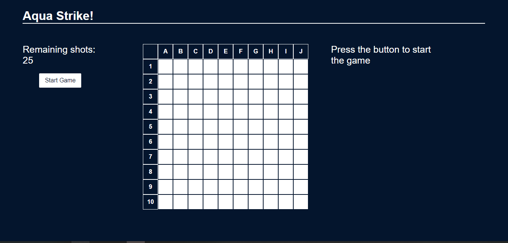

# Battleship game (vs computer)

<table>
    <tr>
         <td></td>
         <td></td>       
    </tr>
</table>

## Setup and Installation

1. **Clone the Repository:**

   `git clone https://github.com/A-Kederys/Battleship-game.git`

2. **Backend Setup:**
   - Open project directory;
   - Navigate to the `server` directory:
     
     `cd Battleship_game/server`
   
   - Install the necessary dependencies:
     
     `npm install`
     
   - Start the server:

     `npm run dev`

3. **Frontend Setup:**
   - Open project directory;
   - Navigate to the `client` directory:
     
     `cd Battleship_game/client`
     
   - Install the necessary dependencies:
     
     `npm install`
   
   - Start the React app:
     
     `npm run dev`
     
   - The frontend application should now be running on `http://localhost:5173`

5. **Gameplay Instructions:**
   - Once both servers are running, open your browser and go to `http://localhost:5173` to access the game;
   - Read [game rules](https://en.wikipedia.org/wiki/Battleship_(game)) and start playing.
